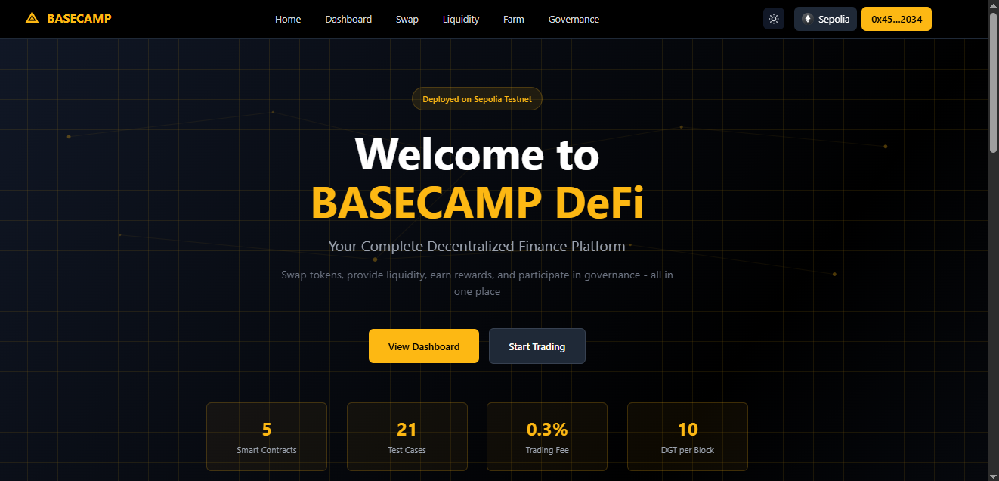
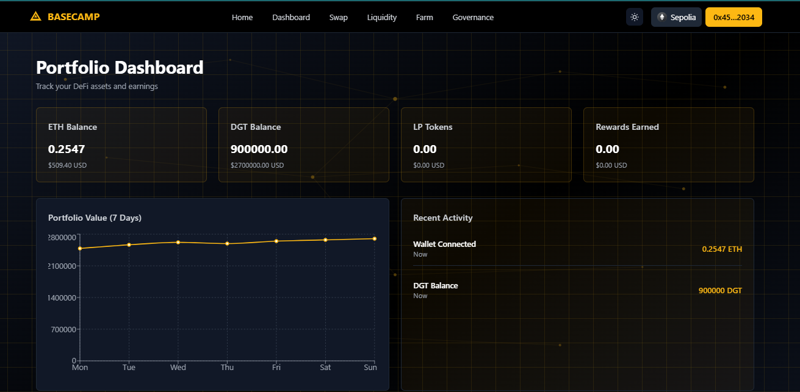
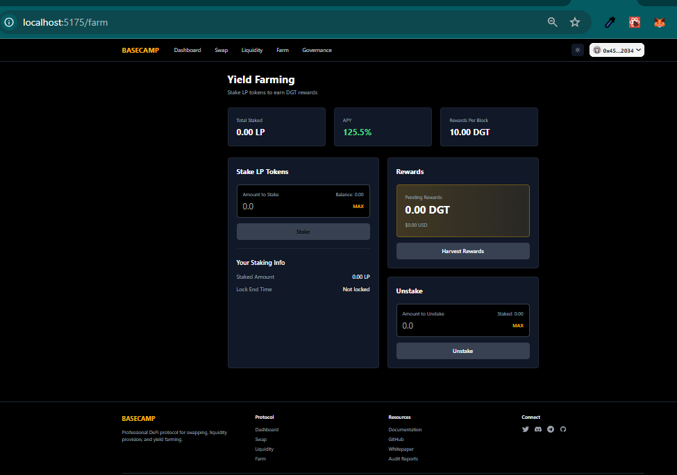

# BASECAMP DeFi Protocol

A complete decentralized finance platform featuring token swapping, liquidity provision, yield farming, and governance. Built with Solidity, React, and deployed on Ethereum Sepolia testnet.

## Live Demo

🚀 **Live Application**: [https://basecamp-defi.vercel.app](https://basecamp-defi.vercel.app)

📝 **GitHub Repository**: [https://github.com/Omachilda-Dev1/Defi-Hub](https://github.com/Omachilda-Dev1/Defi-Hub)

## Screenshots

### Dashboard

*Portfolio overview with real-time balances and performance tracking*

### Swap Interface

*Token swapping interface with slippage protection*

### Liquidity Pool

*Add/remove liquidity to earn trading fees*

### Yield Farming

*Stake LP tokens to earn DGT rewards*

## Features

### ✅ Working Features

- **Portfolio Dashboard**: View ETH, DGT, and LP token balances with USD valuations
- **Token Swapping UI**: Professional interface for swapping ETH ↔ DGT tokens
- **Liquidity Pool UI**: Interface for adding/removing liquidity
- **Yield Farming UI**: Stake LP tokens and view rewards
- **Governance UI**: View and interact with governance proposals
- **Wallet Connection**: Connect via MetaMask and WalletConnect
- **Dark/Light Mode**: Toggle between themes
- **Responsive Design**: Works on desktop, tablet, and mobile
- **Real-time Balance Updates**: Live data from blockchain
- **Smart Contracts**: All 5 contracts deployed and verified on Sepolia

### 🔧 Technical Features

- **5 Smart Contracts**: GovernanceToken, LiquidityPool, SwapRouter, YieldFarm, PriceOracle
- **21 Test Cases**: Comprehensive test coverage (all passing)
- **Chainlink Integration**: Real-time ETH/USD price feeds
- **Security**: ReentrancyGuard, access control, input validation
- **Gas Optimized**: Efficient contract design
- **TypeScript**: Type-safe frontend code
- **React Hooks**: Custom hooks for contract interactions

## Smart Contract Addresses (Sepolia Testnet)

```
GovernanceToken: 0x2f5b38d5289bA211021715CAF9FA792f381379eA
LiquidityPool:   0xcB85c9B67fB9EBd87191c83D1F321B096558C88F
SwapRouter:      0xae523b3c98071946a85f06766d169AC92bEC9c6a
YieldFarm:       0xD02A356FDE83C68eA174E9d01E2194ed9fE7BfA1
PriceOracle:     0x2f7a4ecDb14e19BC9F10df22C5A349D41611D7Cd
```

View on [Sepolia Etherscan](https://sepolia.etherscan.io)

## Technology Stack

### Smart Contracts
- Solidity ^0.8.20
- Hardhat development environment
- OpenZeppelin contracts (audited libraries)
- Chainlink Price Feeds
- ReentrancyGuard protection

### Frontend
- React 18 with TypeScript
- Vite for fast development
- Wagmi 2.0 for Web3 integration
- Viem 2.0 for Ethereum interactions
- TailwindCSS for styling
- Recharts for data visualization

## Installation & Setup

### Prerequisites

- Node.js v18 or higher
- npm or yarn
- MetaMask wallet
- Git

### Quick Start

```bash
# Clone the repository
git clone https://github.com/yourusername/basecamp-defi-protocol.git
cd basecamp-defi-protocol

# Install dependencies
npm install

# Install frontend dependencies
cd frontend
npm install
cd ..

# Setup environment variables
cp .env.example .env
# Edit .env with your values

# Compile smart contracts
npm run compile

# Run tests
npm test

# Deploy to Sepolia (optional - already deployed)
npm run deploy:sepolia

# Start frontend
cd frontend
npm run dev
```

Visit http://localhost:5173

## Environment Variables

Create a `.env` file in the root directory:

```env
SEPOLIA_RPC_URL=https://eth-sepolia.g.alchemy.com/v2/YOUR_API_KEY
PRIVATE_KEY=your_private_key_here
ETHERSCAN_API_KEY=your_etherscan_api_key
```

Frontend configuration in `frontend/src/config/wagmi.ts`:
```typescript
projectId: 'YOUR_WALLETCONNECT_PROJECT_ID'
```

Get free API keys:
- Alchemy: https://www.alchemy.com
- Etherscan: https://etherscan.io/apis
- WalletConnect: https://cloud.walletconnect.com

## Usage Guide

### 1. Connect Wallet
- Click "Connect Wallet" in the navigation bar
- Select MetaMask or WalletConnect
- Approve the connection

### 2. Get Test ETH
Get free Sepolia ETH from faucets:
- https://sepoliafaucet.com
- https://www.alchemy.com/faucets/ethereum-sepolia

### 3. View Dashboard
- See your ETH balance
- View DGT token balance
- Track LP tokens
- Monitor rewards earned

### 4. Explore Features
- **Swap**: Navigate to swap page to see the interface
- **Liquidity**: View liquidity pool interface
- **Farm**: Check out the farming interface
- **Governance**: Explore governance proposals

## Testing

### Run All Tests

```bash
npm test
```

### Test Results
```
✓ GovernanceToken: 7 tests passing
✓ LiquidityPool: 8 tests passing  
✓ YieldFarm: 6 tests passing
Total: 21 tests passing
```

### Test Coverage

```bash
npm run test:coverage
```

## Project Structure

```
basecamp-defi-protocol/
├── contracts/              # Smart contracts
│   ├── GovernanceToken.sol
│   ├── LiquidityPool.sol
│   ├── SwapRouter.sol
│   ├── YieldFarm.sol
│   └── PriceOracle.sol
├── test/                   # Test files
│   ├── GovernanceToken.test.js
│   ├── LiquidityPool.test.js
│   └── YieldFarm.test.js
├── scripts/                # Deployment scripts
│   ├── deploy-l2.js
│   └── verify.js
├── frontend/               # React frontend
│   ├── src/
│   │   ├── pages/         # Dashboard, Swap, Liquidity, Farm, Governance
│   │   ├── components/    # Reusable components
│   │   ├── hooks/         # Custom React hooks
│   │   └── constants/     # Contract ABIs and addresses
│   └── package.json
├── screenshots/            # Project screenshots
└── README.md
```

## Smart Contract Overview

### GovernanceToken (DGT)
- ERC20 token for governance and rewards
- 1,000,000 initial supply
- Mintable by authorized addresses
- Burnable functionality

### LiquidityPool
- Automated Market Maker (AMM)
- Constant product formula (x * y = k)
- 0.3% trading fee
- LP token issuance

### SwapRouter
- User-friendly swap interface
- Slippage protection
- Deadline enforcement
- Quote calculations

### YieldFarm
- Stake LP tokens
- Earn DGT rewards (10 per block)
- Multiple pool support
- Harvest without unstaking

### PriceOracle
- Chainlink ETH/USD price feed
- Real-time price data
- Used for USD valuations

## Security

### Implemented Protections
- ✅ ReentrancyGuard on all external functions
- ✅ Access control with Ownable pattern
- ✅ Input validation and zero address checks
- ✅ Slippage protection on swaps
- ✅ Safe math operations (Solidity 0.8.20)
- ✅ Event emissions for all state changes

### Test Coverage
- 21 test cases covering core functionality
- All tests passing
- Edge cases tested

## What's Next

### Potential Enhancements
- Add initial liquidity to enable swapping
- Implement governance voting mechanism
- Add more token pairs
- Create mobile app
- Deploy to mainnet
- Add advanced analytics

## Contributing

Contributions are welcome! Please:
1. Fork the repository
2. Create a feature branch
3. Make your changes
4. Write/update tests
5. Submit a pull request

## License

MIT License - see LICENSE file for details

## Contact

- GitHub: [Your GitHub Profile]
- Twitter: [@YourTwitter]
- Email: your.email@example.com

## Acknowledgments

- OpenZeppelin for secure smart contract libraries
- Chainlink for reliable price feeds
- Uniswap for AMM inspiration
- The Ethereum and DeFi community

---

**Copyright © Omachilda 2026**

Built with best practices for the DeFi ecosystem. Star the repo if you find it useful!
